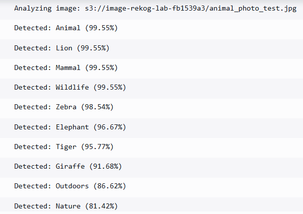

## Automated Image Labels Generator (AWS Rekognition)

This project is to build a seamless, serverless, event-driven cloud application that automatically analyzes images uploaded to S3 and identifies objects using AI-powered (through AWS' Rekognition) label detection, reporting results to CloudWatch.

### Project Overview

This project demonstrates a production-grade serverless architecture. When an image is uploaded to a specific S3 bucket, a Lambda function is automatically triggered. This function interacts with Amazon Rekognition to detect objects, filtering results based on a configurable confidence threshold (in my case, 80%) to ensure data quality.

### Architecture

Storage: Amazon S3 (Landing Zone)
Compute: AWS Lambda (Python 3.9)
AI Service: Amazon Rekognition
IaC: Terraform
Observability: Amazon CloudWatch Logs

**Test Input:**

**CloudWatch Output/Results:**
The screenshot below displays the labels correctly identifying the fruit with over 80% confidence:

### Cloud Engineering Standards
Infrastructure as Code: 100% of the resources are provisioned via Terraform, ensuring repeatable deployments.

Principle of Least Privilege: IAM roles are scoped strictly to the required S3 bucket and Rekognition actions, following AWS security best practices.

Environment-Agnostic: Configuration is handled via Lambda environment variables rather than hard-coding.

### Lessons Learned & Challenges

Git Large File Management - During initial deployment, heavy Terraform provider binaries were accidentally tracked. I successfully performed a git reset --hard and implemented a global wildcard .gitignore (**/.terraform/) to keep the repository lightweight and professional.

OneDrive Sync Conflict - Encountered file-locking issues while working within a OneDrive directory. Resolved by ensuring the project was local to the machine to prevent sync-lock errors with Terraform state files.

### Future Enhancement

Frontend: Build a simple React app to display the processed images and their bounding boxes for visuals.